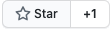

# django-referral-system

[](https://github.com/soldatov-ss/django-referral-system/actions/workflows/ci.yml)
[](https://badge.fury.io/py/django-referral-system)
[](https://github.com/soldatov-ss/django-referral-system/blob/main/LICENSE)
[](https://pypi.org/project/django-referral-system/)
[](https://coveralls.io/github/soldatov-ss/django-referral-system?branch=main)

**A plug-and-play Django referral engine.** Track promoters, reward commissions, manage payouts — all wired up in minutes.

Full documentation: [Read the Docs](https://django-referral-system.readthedocs.io/en/latest/index.html)

---

## What it does

| Area | Capability |
|------|------------|
| **Promoters** | Create and manage promoters with unique referral tokens and links |
| **Referral tracking** | Track sign-ups, activation status, and click counts per link |
| **Commissions** | Configurable commission rates tied to the active referral program |
| **Payouts** | Wise CSV export; auto-skip promoters below minimum withdrawal balance |
| **Refunds** | Commission is automatically reversed when a referred user refunds |
| **Email invitations** | Send branded HTML invite emails via a custom template |

Only one referral program can be active at a time, keeping the logic focused and predictable.

---

## Quick start

**1. Install**

```bash
pip install django-referral-system
```

Requires Python 3.9 – 3.14 and Django 4.2+.

**2. Add to `INSTALLED_APPS`**

```python
INSTALLED_APPS = [
    ...
    "referrals",
]
```

**3. Mount the URLs**

```python
from django.urls import path, include

urlpatterns = [
    ...
    path("referrals/", include("referrals.urls")),
]
```

**4. Migrate**

```bash
python manage.py migrate
```

**5. Create a referral program**

```bash
python manage.py create_referral_program \
    --name="My Referral Program" \
    --commission-rate=5.00 \
    --min-withdrawal-balance=10.00
```

Setting a program as active automatically deactivates any existing active program.

---

## Environment variables

| Variable | Purpose |
|----------|---------|
| `BASE_REFERRAL_LINK` | Base URL used when generating referral links |
| `BASE_EMAIL` | Sender address for invitation emails |

---

## License

MIT — see [LICENSE](LICENSE) for details.

## Contributing

Issues and pull requests are welcome. If this project saves you time, a star on GitHub goes a long way. 
